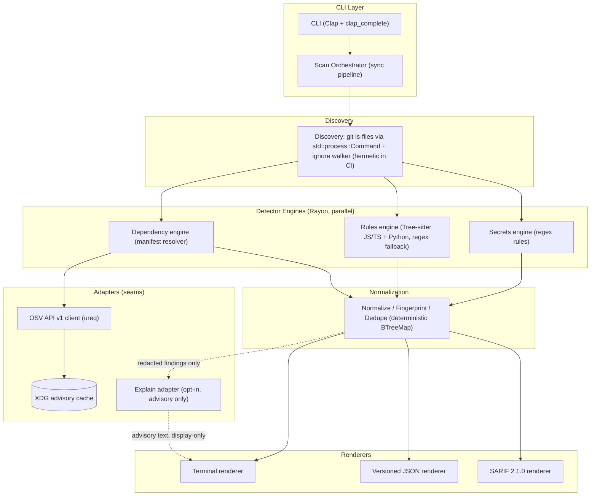
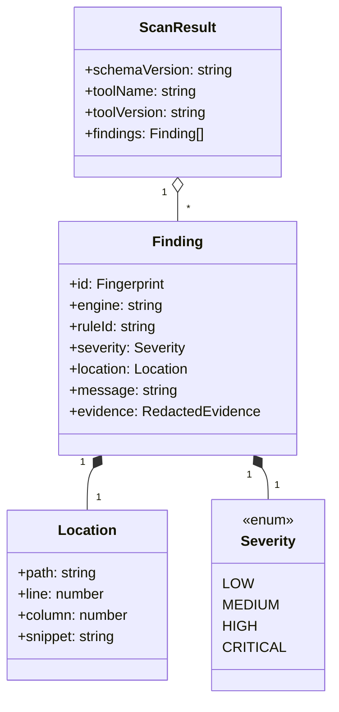

# ARCHITECTURE.md

> **Status**: Review &nbsp;|&nbsp; **Last updated**: 2026-08-04 &nbsp;|&nbsp; **Author**: Jonathan Soto (architecture owner, design-architecture delegation)

### Section Map — applicability

| Section | Present? | Why |
|---------|----------|-----|
| System Overview | Yes | Core contract |
| Architecture Pattern | Yes | Core contract |
| Architecture Views & Diagrams | Yes | System diagram + runtime sequence + findings model |
| Component Details | Yes | Core contract |
| Data Architecture | Yes | XDG cache strategy; no database |
| API Architecture | No | No inbound API surface; outbound adapter contracts live in Component Details |
| Async Delivery | No | No queues/events in the MVP |
| Non-Functional Requirements | Yes | Performance, determinism, security, privacy, observability, maintainability, supply chain |
| Key Decisions | Yes | Core contract |
| Failure Modes & Mitigations | Yes | Network, cache, parse, traversal failure modes |
| ADRs | Yes | ADR-0001..0003 |
| Appendix | Yes | Versioned JSON envelope contract + testing strategy |

## System Overview **[ALWAYS]**

Sentinel is a cross-platform Rust CLI that scans a Git repository for secrets and vulnerable dependencies before commit or in CI. It runs entirely locally as a single synchronous process: files are discovered the way Git sees them, parallel detector engines (regex secrets, Tree-sitter rules for JavaScript/TypeScript and Python, dependency review against the OSV API v1) produce findings, findings are normalized, fingerprinted and deduplicated deterministically, and renderers emit terminal, versioned JSON, or SARIF 2.1.0 output. There is no server, no database, and no mandatory third-party call: the only persistent state is a TTL'd XDG cache of OSV advisory data, and an opt-in LLM explainer adds context without ever influencing severity or blocking.

---

## Architecture Pattern **[ALWAYS]**

**Chosen pattern**: Modular Monolith — a single binary crate (`Edition 2024`, stable Rust) whose pipeline stages are in-process modules with explicit boundaries.

**Why this pattern**:
The product is a short-lived, single-invocation CLI whose entire runtime is one scan: a distributed or daemonized topology would add packaging, lifecycle, and cross-process state for zero product value. A modular monolith keeps the deterministic, sync/stdio pipeline trivially orderable while module boundaries (discovery, engines, normalization, renderers, adapters) preserve testability and leave room for future extraction — the PRD already names oxc-based JS/TS analysis as a staged future direction, which lands as a new engine inside the same boundaries.

**Alternatives evaluated**:
- **Client/server with daemon + local database**: rejected — violates the MVP non-goals (no server, no SQL/NoSQL), complicates pre-commit installation, and reintroduces state that fingerprints and the XDG cache deliberately avoid.
- **Async runtime (Tokio) pipeline**: rejected — the workload is short-lived and I/O-light (batched HTTP, cached OSV data); Rayon covers the only real parallelism need (CPU-bound detection over files), and Tokio adds runtime complexity without a latency requirement it satisfies.
- **Cargo workspace with multiple crates**: rejected — a single crate keeps the MVP shippable as one binary with one dependency set; module boundaries are enforced by convention and tested via public interfaces, not by crate seams.

---

## Architecture Views & Diagrams **[ALWAYS]**

### System Architecture Diagram



> Invariant carried by the diagram: the only edges into the LLM adapter are dashed — redacted findings in, advisory text out. There is no edge from `LLM` back to `Norm`, to severity, or to the process exit code.

### Runtime Flow — end-to-end scan

```mermaid
sequenceDiagram
    actor Dev as Developer / CI
    participant CLI as CLI (Clap)
    participant Orc as Scan Orchestrator
    participant Disc as Discovery
    participant Eng as Detector Engines (Rayon)
    participant Norm as Normalize/Fingerprint/Dedupe
    participant OSV as OSV API v1 (ureq)
    participant Cache as XDG cache
    participant Rep as Renderers

    Dev->>CLI: sentinel scan [--offline] [--ci] [--explain] [--output json|sarif|terminal] [--report file]
    CLI->>Orc: parsed config (modes, exclusions, output)
    Orc->>Disc: discover files (git-aware, hermetic in CI)
    Disc-->>Orc: file set (repo-relative paths)
    Orc->>Eng: parallel dispatch (Rayon)
    Eng->>OSV: POST /v1/querybatch (+ pagination, detail fetches) -- except offline
    OSV->>Cache: read/refresh (TTL, atomic writes)
    Cache-->>OSV: cached or fresh advisory data
    OSV-->>Eng: findings (redacted at engine boundary)
    Eng-->>Orc: raw findings
    Orc->>Norm: fingerprint + dedupe + deterministic sort
    Norm-->>Orc: ordered, deduplicated findings
    Orc->>Rep: render
    Rep-->>Dev: terminal / versioned JSON / SARIF 2.1.0; exit code
```

### Findings Data Model (in-memory; serialized by renderers)

The findings model is the shared kernel of the pipeline. It is in-memory only — no persistence — and every field below is part of the stable result contract (see Appendix: Versioned JSON envelope).



---

## Component Details **[ALWAYS]**

### CLI (Clap + clap_complete)

- **Technology**: Rust, clap derive, clap_complete.
- **Responsibility**: Parse the `scan` command and modes (`--offline`, `--ci`, `--explain`, `--output`, `--report`), generate shell completions, map results to the stable exit-code contract.
- **Scaling**: None — single invocation; not a service.
- **Dependencies**: Scan orchestrator; no business logic (thin controller per module-design guidance).
- **Failure modes**: Invalid args/unknown flags → Clap error, exit code 2 (operational), usage on stderr. Completions generation is a pure side command.

**Exit-code contract** (part of the CLI surface; exact values confirmed during implementation planning):
- `0` — scan completed, no findings that block.
- `1` — scan completed, findings present (blocking policy applied, e.g., CI gate).
- `2` — operational failure (git unavailable, I/O error, unrecoverable internal error).
- The `--explain` adapter can never influence this contract — a scan with and without `--explain` exits identically given the same findings.

### Scan Orchestrator

- **Technology**: Rust, plain synchronous composition.
- **Responsibility**: Run the fixed pipeline — discovery → parallel engines → normalization → dedupe → deterministic order → renderers — and coordinate mode flags (offline, CI, explain).
- **Scaling**: CPU parallelism is delegated to Rayon inside the engine stage only; the orchestrator itself is single-threaded and deterministic.
- **Dependencies**: Discovery, engines, normalizer, renderers, explain adapter.
- **Failure modes**: Any stage failing hard aborts the scan with exit code 2; engine-local failures (parse errors, network degradation) are contained per-engine and never abort the whole scan (see Failure Modes).

### Discovery

- **Technology**: `std::process::Command` (git), `ignore` crate walker.
- **Responsibility**: Produce the file set "the way Git sees it": tracked files via `git ls-files` plus worktree traversal for untracked-but-present files, honoring repository-local ignore rules.
- **Hermetic CI behavior**: in CI mode, the `ignore` walker disables ambient sources — `parents(false)` (no ignore files above the repo root), `git_global(false)` (no user-global `.gitignore`), `git_exclude(false)` (no `.git/info/exclude`), and `require_git(true)` — so results depend only on repository-local `.gitignore`, the repo-local custom ignore file (e.g., `.sentinelignore` via `add_custom_ignore_filename`), and explicit exclusions (CLI glob patterns). File name of the custom ignore file is confirmed during implementation planning.
- **Scaling**: Parallel walk is not needed; the file set is a flat list consumed by the parallel engine stage. A maximum-file-size guard bounds pathological inputs.
- **Dependencies**: `git` executable present on PATH (hard dependency — verified up front with a clear error otherwise); ignore crate.
- **Failure modes**: Not a git repository or git missing → hard error, exit code 2 (discovery is fundamental to correctness). Unreadable files / broken symlinks → skip with warning at debug level.

### Detector Engines (Rayon, parallel)

All engines share one contract: file or manifest input → zero or more **raw findings** with engine-local rule IDs and severity, with secret values **redacted at this boundary** (raw values never leave an engine). Engines are independent — one engine failing does not affect the others.

- **Secrets engine (regex)**: curated regex rule set for API keys, tokens, and credentials over file bytes; emits redacted evidence only.
- **Rules engine (Tree-sitter)**: AST rules for JavaScript/TypeScript and Python; per-file parse failure degrades to regex fallback for that file (warn at debug level), never a scan abort. Detects vulnerable patterns the regex layer cannot express (e.g., weak crypto API misuse within scope of MVP rule set).
- **Dependency engine**: resolves declared dependencies from supported manifests (npm family for JS/TS, PyPI for Python) into canonical `(ecosystem, package, version)` triples, then queries the OSV adapter. Offline or degraded → warns and skips dependency findings; never fails the scan.

- **Technology**: Rust, rayon, regex, tree-sitter (JS/TS/Python grammars), serde/toml for manifests.
- **Scaling**: Rayon `par_iter` over the file set (secrets, rules) and over manifest lists (dependency). Results are collected into plain vectors — parallelism never touches ordering (see Invariants).
- **Dependencies**: Discovery output; OSV adapter (dependency engine only); normalizer.
- **Failure modes**: Engine panic or per-file failure → contained (fallback/warn), not propagated.

### Normalize / Fingerprint / Dedupe

- **Technology**: Rust, `BTreeMap` keyed by fingerprint; stable hashing.
- **Responsibility**: Collapse raw findings into the canonical `Finding` model: normalize paths/locations, compute the stable fingerprint, deduplicate across engines and files, and produce the deterministic output order.
- **Scaling**: Single-threaded; operates on the deduplicated finding set, not file contents.
- **Dependencies**: Engine output.
- **Failure modes**: None realistic — pure computation over in-memory data.

### OSV API v1 Client (adapter — seam)

- **Technology**: Rust, ureq (synchronous HTTP/1.1+TLS); `serde_json` for responses.
- **Responsibility**: Query advisory data for `(ecosystem, package, version)` triples via `POST /v1/querybatch` (batched queries), follow pagination (`next_page_token`), fetch per-advisory detail via `GET /v1/vulns/{id}` when batch summaries are insufficient, normalize ecosystems and versions to OSV's namespaces (`npm`, `PyPI`), and serve everything through the XDG cache.
- **Seam justification**: the client sits behind an `OsvApi` interface with two real adapters — the HTTP adapter (production) and a local stub server adapter (tests). No mocking of internal code.
- **Scaling**: Batching bounds request count; cache bounds repeat traffic.
- **Dependencies**: Cache (for reads/writes); network (online mode only).
- **Failure modes**: Network failure/timeouts → bounded retry (transient only: connection resets, 429, 5xx) with exponential backoff + jitter; final failure → degrade to stale cache with warning, or skip dependency findings if no cache entry exists. API shape change → covered by contract tests and schema-versioned cache; treated as untrusted input and validated before use.

### XDG Advisory Cache

- **Technology**: Rust, `directories` for cross-platform cache dirs (Linux `$XDG_CACHE_HOME`, macOS `~/Library/Caches`, Windows `%LOCALAPPDATA%`), serde_json, atomic write (temp file + rename).
- **Responsibility**: The only persistent state. Stores OSV query batch results and advisory details under a schema-versioned subdirectory, keyed by `(ecosystem, package, version)`, with a default TTL (24 h). In offline mode the TTL is ignored — whatever the cache holds is served.
- **Scaling**: Single process, atomic rename = last-writer-wins; no locks needed for the MVP (concurrent scans may duplicate a refresh; harmless).
- **Dependencies**: OSV client; filesystem.
- **Failure modes**: Corrupt/unreadable entry → treated as a cache miss (warn, refetch). Write failure → warn and continue online; cache never contains secret material, only advisory JSON (validated schema before caching).

### Renderers

- **Technology**: Rust; terminal (plain text, tty-aware), `serde_json` (versioned JSON), SARIF 2.1.0 (OASIS schema).
- **Responsibility**: Pure functions from `ScanResult` to output bytes. Terminal → stdout; JSON and SARIF → stdout or `--report` file; diagnostics always stderr.
- **SARIF contract**: `sarifLog` with `version: "2.1.0"` and `$schema` URI; `runs[].tool.driver` (name, version, `rules[]` with stable rule IDs); `results[]` with `ruleId`, `rule.index` reference, severity mapping, and `locations[].physicalLocation` with repo-relative `artifactLocation.uri` + `region` (line/column). Timestamps are omitted so runs are byte-identical.
- **Scaling**: None — linear in finding count.
- **Dependencies**: Normalized findings.
- **Failure modes**: None realistic; output errors (unwritable `--report` path) → exit code 2.

### Explain Adapter (LLM — advisory only)

- **Technology**: Rust, ureq (synchronous HTTPS); isolated module behind an `Explainer` interface (HTTP adapter + test stub adapter).
- **Responsibility**: When explicitly enabled, produce advisory explanation text for findings. Enforced boundaries (see ADR-0003):
  - Context is built **exclusively from redacted findings** — the redaction boundary in the engines makes raw secret values structurally unreachable.
  - Fixed context budget (max characters per finding and per scan); single synchronous HTTP call per finding (or small batch), no retries.
  - Responses are **untrusted**: length-capped, control characters stripped, treated as display-only strings — never parsed into severity, blocking, or exit-code structures (those are immutable after normalization).
  - **Disabled by default**; forced off in CI mode and offline mode; failure (timeout, error, missing key) → warning only, output identical to a scan without `--explain`.
- **Scaling**: None — per-finding synchronous calls, opt-in only.
- **Dependencies**: Normalized findings (redacted); network; user-provided endpoint/key configuration.
- **Failure modes**: Any failure is a warn-and-continue; zero impact on findings, severity, ordering, or exit code.

---

## Data Architecture **[CONDITIONAL — XDG cache is the only persistent state]**

### Database Selection

| Database | Type | Purpose | Rationale |
|----------|------|---------|-----------|
| None | — | No SQL/NoSQL in the MVP | PRD non-goal; scan state is in-memory and ephemeral; the XDG cache is a filesystem of JSON entries, not a database |

### Caching Strategy

| What is cached | Where | TTL | Invalidation |
|---------------|-------|-----|-------------|
| OSV querybatch results + advisory details | XDG cache dir, schema-versioned subdir, keyed `(ecosystem, package, version)` | 24 h (online); ignored in offline mode | TTL expiry + schema version bump (format changes invalidate the whole cache cleanly) |

- **Source of truth**: the OSV API v1; the cache is a copy with a defined staleness contract (max 24 h in online mode; unbounded by design in offline mode).
- **Stampede protection**: single-flight per key within one scan; cross-process refresh duplication is tolerated (atomic rename, last-writer-wins; no locks in the MVP).
- **Failure behavior**: read-through to source on TTL expiry; on network failure serve stale (warn) or skip (no entry, warn); never fail closed — dependency findings degrade, the scan continues.

### Consistency & Concurrency

- The in-memory pipeline has no shared mutable state: engines produce independent vectors; normalization is a pure fold into a `BTreeMap<Fingerprint, Finding>`.
- The only concurrency decision is the ordering contract: Rayon results are collected into vectors in a deterministic stage boundary; output order is always `(fingerprint, path, line)` — never execution order.
- No dual-write hazard exists: the cache is written by one process, atomically, from validated advisory JSON only.

---

## Non-Functional Requirements **[CONDITIONAL]**

### Performance

- Full scan of a typical repository (tens of thousands of files, e.g. 50k files) completes in **≤ 60 s** on a mid-range machine (PRD KPI 1).
- OSV network phase budget **≤ 30 s** (per-request timeout ≤ 10 s, bounded retries, bounded pagination pages); warm-cache scans are dominated by CPU detection, not network.
- Peak memory: findings and per-file buffers in memory; file contents are not all retained — target **< 1 GB** peak RSS on the 50k-file corpus.
- Determinism is a performance-adjacent property: repeated runs on the same tree and cache state produce **byte-identical** outputs (PRD KPI 2).

### Security

- Secret values never appear in outputs, LLM context, logs, or cache (PRD KPI 4); redaction is enforced at the engine boundary so no downstream component can see raw values.
- `--explain` can never influence severity, blocking, or pass/fail outcomes (PRD KPI 3); enforced structurally (advisory-only interface, immutable severity/exit-code path).
- Outbound HTTP is HTTPS-only (ureq TLS) for OSV and the LLM endpoint.
- Untrusted input surfaces (OSV responses, LLM responses, repo content) are validated/sanitized at the trust boundary where they enter (per api-design guidance: validate at the edge, not everywhere).
- No telemetry, no phone-home beyond explicit OSV queries and explicit `--explain` calls.

### Privacy

- OSV queries contain only package names and versions — never repository content or file paths.
- LLM context is limited to redacted finding summaries within a fixed budget; no PII classification applies to the XDG cache (advisory data only, public class).
- No persistent state beyond the advisory cache; no audit-log regime applies (no state-changing service surfaces — per nfr-checklist audit rules, not applicable).

### Observability

- `tracing` + `tracing-subscriber` to **stderr** only; stdout is reserved for findings/reports.
- Structured spans per stage (scan, discovery, per-engine, normalize, render, explain); events for degradations (OSV degraded, cache miss, LLM skipped/failed) at warn level in default verbosity.
- Verbosity controlled via `RUST_LOG`; spans/events must never carry secret material (only redacted evidence and counts).
- Alerting before users report does not apply (local CLI, no service) — the analogous contract is: warnings reach stderr in default mode, and failures map to stable exit codes.

### Maintainability

- Single crate, edition 2024, stable toolchain; `cargo fmt --check` and `cargo clippy -- -D warnings` in CI; full test suite (assert_cmd, insta, tempfile) in CI (PRD acceptance criterion).
- Module boundaries are enforced by convention + tests against public interfaces; no architecture-test tooling in the MVP.
- `Cargo.lock` committed (application crate → reproducible builds); `cargo audit` and `cargo deny` run in CI.

### Supply Chain / Release

- Release artifacts signed, checksummed, and shipped with an SBOM (README commitment) — recorded here at architecture level; workflow files themselves are owned by the github-environment skill, out of scope for this document.
- Dependency provenance: registries only (crates.io), lockfile committed; vulnerability scanning of Sentinel's own dependencies on every build.

---

## Key Decisions **[ALWAYS]**

| Decision | Rationale | Alternatives Considered |
|----------|-----------|------------------------|
| Single binary crate, modular monolith, sync stdio pipeline | Matches single-invocation CLI lifecycle; trivial determinism; single artifact to distribute; PRD non-goals (no daemon, no DB, no Tokio) | Client/server + daemon + local DB; Tokio pipeline; multi-crate workspace — ADR-0001 |
| No database; XDG advisory cache only | PRD non-goal; scan state is ephemeral; cache gives offline + speed without schema/ops burden | SQLite local store; no cache at all — ADR-0001/ADR-0002 |
| Git-aware discovery via `std::process::Command` + `ignore` walker; hermetic in CI (`parents(false)`, `git_global(false)`, `git_exclude(false)`, `require_git(true)`) | "The way Git sees it" is authoritative for pre-commit/CI; hermetic mode removes ambient machine ignore config from CI results (PRD product rule) | Pure filesystem walk ignoring .gitignore (loses user intent); own git-ls-files parser (re-invents git) |
| Rayon parallel engines, deterministic normalization (BTreeMap by fingerprint, order = fingerprint/path/line) | CPU-bound detection is the parallel hot spot; ordering must never depend on execution order (PRD edge case) | async/Tokio I/O parallelism (no need); lock-based shared finding store (race-prone) |
| Stable fingerprints + dedupe across engines/runs | PRD KPI 2; attribution and reproducibility for reviewers; stable fingerprints exclude run-dependent data (timestamps, absolute paths, execution order) | Run-order keys (non-deterministic); hash of raw evidence only (unstable across line moves) |
| OSV client: batch query + pagination + detail fetches, TTL 24 h cache, offline degrade (warn/skip, never fail) | Batch minimizes requests; pagination is a documented research constraint; TTL bounds staleness; offline is a PRD product rule | Cacheless online-only (violates offline rule); full local advisory DB (violates no-DB); infinite cache (unbounded staleness) — ADR-0002 |
| Explain adapter: isolated, opt-in, sync HTTP, redacted context, untrusted output, never severity/blocking, off in CI/offline | PRD hard rule enforced by construction; redaction at engine boundary makes raw secrets structurally unreachable | LLM-in-the-loop severity (explicitly rejected by PRD); no explainer (PRD lists it in scope) — ADR-0003 |
| Errors: thiserror for domain errors, anyhow for app composition; tracing to stderr | Domain errors are typed and stable (rule/engine errors); app layer composes without ceremony; stdout reserved for findings | Custom error enum everywhere (boilerplate); panics on failure (no exit-code contract) |
| Tree-sitter with per-file regex fallback | Grammar coverage gaps are a known risk (PRD risk register); fallback keeps scans whole and findings deterministic per rule set | Pure AST-only (gaps → silent misses); regex-only (loses AST value) |
| Out-of-bound adapters behind interfaces with two real adapters (HTTP + local stub server) | Module-design rule: seams only with real adapters; tests exercise the public interface | Mocking own internals (smell); no seam (network-bound tests) |

---

## Failure Modes & Mitigations **[CONDITIONAL]**

| Failure | Impact | Mitigation |
|---------|--------|------------|
| `git` missing or not a repository | Discovery cannot produce a file set — the scan is meaningless | Detect up front; clear error on stderr; exit code 2 (validated by assert_cmd tests against non-repo temp dirs) |
| OSV API unreachable (online mode) | Dependency findings unavailable; possible hang without timeouts | Per-request timeout ≤ 10 s; retry transient failures (conn reset, 429, 5xx) with bounded exponential backoff + jitter; final failure → stale cache + warn, or warn + skip dependency engine; scan completes with secrets/rules findings; validated by stub-server tests simulating failure |
| OSV API shape/behavior change (pagination semantics, payload drift) | Corrupt or partial advisory data; cache poisoning | Adapter validates response shape at the trust boundary; schema-versioned cache; contract tests against the pinned API reference; cache entries failing validation are treated as misses |
| Cache corruption / partial writes / schema drift | Wrong or stale advisory data | Atomic write (temp + rename) prevents partial entries; per-entry validation on read; schema-versioned cache subdir; corrupt entry → warn + refetch (validated by corruption fixture tests) |
| Tree-sitter parse failure on a real-world file | Missing AST findings for that file | Per-file regex fallback for the same rule class + debug-level warning; engine continues; validated by fixture files that intentionally fail parsing |
| Pathological inputs (huge single file, huge repo) | Time/memory blowup | Max-file-size guard (skip + warn); bounded traversal; sub-minute NFR tested on a generated corpus; peak-RSS target checked in CI on the fixture corpus |
| `--explain` endpoint failure/timeout | Missing advisory text | Single attempt, no retries, bounded timeout; warn + continue; findings/severity/exit code byte-identical to the non-explain scan (validated by differential tests) |
| Ambient ignore config leaks into CI results | Non-hermetic, machine-dependent scans | Hermetic CI mode disables parent/global/exclude ignore sources; validated by tests planting ignore files above the repo root and asserting no effect |
| Unreadable file / broken symlink mid-scan | Engine misses a file | Skip with warning (debug level); scan continues; exit code unaffected |

> Failure validation: every network/cache row above carries a test-based validation (stub server, seeded cache fixtures, corruption fixtures) — the mitigations are exercised in CI, not just intended.

---

## ADRs **[ALWAYS]**

- [ADR-0001: Single synchronous process, no database](docs/adr/0001-single-sync-process-no-db.md)
- [ADR-0002: OSV cache and offline policy](docs/adr/0002-osv-cache-offline-policy.md)
- [ADR-0003: Advisory-only LLM boundary](docs/adr/0003-advisory-only-llm-boundary.md)

---

## Appendix **[OPTIONAL]**

### Versioned JSON envelope contract

The versioned JSON output is a stable machine contract for tooling; its stability rules are architecture-level:

- Top level: `schema_version` (string, semver), tool metadata (`name`, `version`), and a `findings` array sorted by `(fingerprint, path, line)`.
- Per finding: `id` (the stable fingerprint), `engine`, `rule_id`, `severity`, `location` (repo-relative path, line, column, redacted snippet), `message`, and redacted `evidence`.
- **Stability rules**: no timestamps or run-derived fields (byte-identical reruns); fields are additive only; a breaking change increments `schema_version` and ships in a new minor/major release with documented migration; `rule_id` values are stable across releases (renames require `deprecatedIds`-style aliasing — the SARIF `reportingDescriptor.deprecatedIds` mechanism is the precedent for the JSON envelope as well).
- SARIF 2.1.0 output follows the OASIS standard (minimal valid log requires `version: "2.1.0"` and `runs[].tool.driver.name`); Sentinel adds `$schema`, driver `version`, `rules[]`, and `results[]` with full locations; ingestibility is validated in CI.

### Testing strategy

- **Boundaries**: modules are tested through their public interfaces (the interface is the test surface — module-design rule); seams exist only where two real adapters do (OSV client: HTTP vs local stub server; explainer: HTTP vs stub; clock injection for cache TTL).
- **Unit**: engine rule tests over the fixture corpus; fingerprint/dedupe determinism tests (identical inputs → identical fingerprints; distinct evidence → distinct fingerprints); normalization tests (path separators, line endings, ecosystem/version normalization).
- **Integration (assert_cmd)**: exit-code contract; stdout/stderr separation; redaction (assert raw secret strings absent from outputs, logs, cache); hermetic CI ignore behavior; offline mode with seeded cache; differential `--explain` (with/without → byte-identical findings, severity, exit code).
- **Snapshots (insta)**: golden files for terminal renderer, versioned JSON envelope, and SARIF output; SARIF additionally validated against the 2.1.0 schema.
- **Fixtures (tempfile + committed corpus)**: synthetic secrets (never real credentials), manifests with pinned known-OSV-ID vulnerable versions, intentional parse-failure files, corrupt cache entries, and ambient-ignore trees. The OSV integration corpus is exercised against the stub server with cached OSV fixture responses — no network in tests.
- **Determinism gate**: every CI test job that produces output runs the scan twice and byte-compares.
- **Cross-platform**: the suite runs on Linux, macOS, and Windows (line-ending normalization and path handling are exercised per-OS; workflows are owned by github-environment).

### Explicitly out of scope (future expansion)

- oxc-based JS/TS parsing (staged future work) will land as a new engine inside the existing rules-engine boundary — no topology change required.
- Additional ecosystems, advisory sources, and richer LLM explanation modes are PRD-staged future work; the LLM boundary rule applies to any future mode.
- Auto-fix, interactive/daemon/watch modes, telemetry, and any hosted backend remain non-goals.
